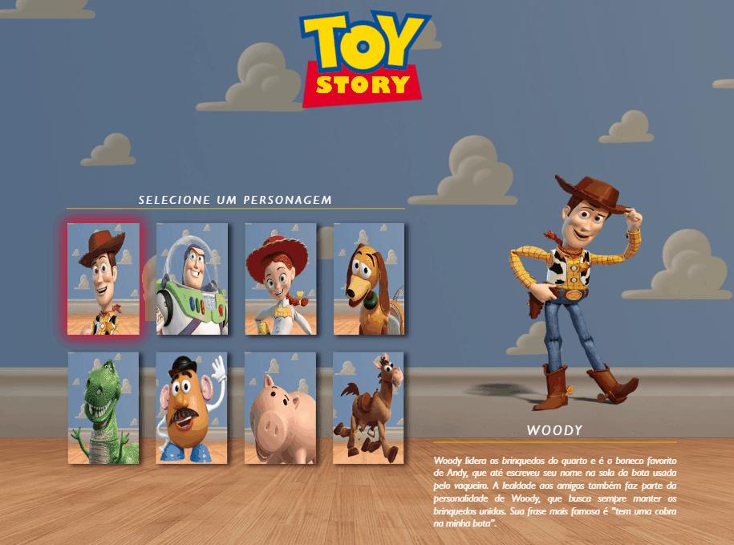

# Projeto-Toy-Story

## Sumário

- [Sobre o projeto](#sobreoprojeto)
- [Layout  desktop](#layout-desktop)
- [Layout tablet](#layout-tablet)
- [Layout mobile](#layout-mobile)

- [Tecnologias utilizadas](#tecnologias-utilizadas)
- [O que eu aprendi](#o-que-eu-aprendi)
- [Acesso a página](#acesso-a-página)

## Sobre o projeto

Nesse projeto, desenvolvi uma página web interativa que permite aos usuários selecionar diferentes personagens do filme Toy Story. A página apresenta uma lista de personagens com suas respectivas imagens e informações, como nome e descrição. Ao passar o mouse sobre um personagem, a imagem principal é atualizada para exibir uma versão ampliada do personagem selecionado, juntamente com seu nome e descrição correspondentes.
 
 

## Layout desktop    

 

 
 

## Layout tablet

 
 

## Layout mobile

 
 

## Tecnologias utilizadas

- HTML
- CSS
- JS

## O que eu aprendi

Foi um projeto bem divertido de se trabalhar, pois envolveu o uso de recursos interativos e a exibição de informações dinâmicas aos usuários. Pude manipular o DOM fazendo uso de (functions, innerText, getAttribute), alem do uso de data-name e data-description.

## Acesso a página

Se você quiser conferir o projeto pronto [clique aqui ](https://claricassia.github.io/Formulario-com-validacao-JS/)